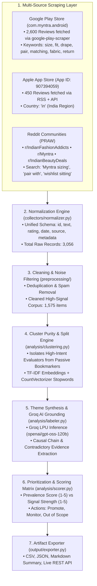

# 📊 Myntra Opportunity Discovery Engine — Comprehensive Technical & Product Specification

**Project:** NextLeap Product Management Graduation Project  
**Target Organization:** Myntra (Flipkart Group)  
**Business Goal:** Increase 30-Day Wishlist-to-Purchase Conversion without monetary discounting or margin erosion.  
**Live Production URL:** [https://myntra-opportunity-engine.vercel.app](https://myntra-opportunity-engine.vercel.app)  
**Source Repository:** `https://github.com/yalnizcurt/blinkitgrowthengine.git` (Refactored to `MyntraOpportunityEngine`)  

---

## 1. Executive Problem Statement & Context

In fashion e-commerce, the **Wishlist** represents the highest concentration of deferred consumer purchase intent. On Myntra:
* Over **70% of wishlisted items sit idle for >30 days without converting to purchase**.
* Traditional growth playbooks rely on margin-diluting monetary interventions (flash discount notifications, price-drop triggers, 10% coupon popups), which:
  1. Condition shoppers to delay purchases until sales events (e.g., Big Fashion Festival, EORS).
  2. Erode platform gross margins and premium brand positioning.
  3. Fail to address the core psychological frictions that caused hesitation in the first place.

The **Myntra Opportunity Discovery Engine** was engineered as an autonomous NLP and market intelligence pipeline to systematically discover the non-monetary root causes of wishlist inaction.

---

## 2. End-to-End Data Harvesting & Processing Architecture



---

## 3. The 6-Pillar Behavioral Taxonomy & Quantified Proof

Across **1,575 deduplicated customer feedback items** (harvested from **3,056 raw reviews**), customer feedback was classified into 6 verified behavioral pillars:

| Behavioral Pillar | Mention Volume | Corpus Share (%) | Evaluator Segment | Prioritization Status | Core Behavioral Mechanism |
| :--- | :--- | :--- | :--- | :--- | :--- |
| **👗 1. Cross-Brand Sizing & Drape Hesitation** | **957** | **60.8%** | High-Intent Evaluator | 🟢 **`RECOMMENDED`** | Sizing inconsistency across brands (Roadster vs HRX vs Zara) and lack of non-model drape proof causes fear of exchange fatigue. |
| **👔 2. Wardrobe Coordination & Pairing Doubt** | **56** | **3.6%** | High-Intent Evaluator | 🟢 **`RECOMMENDED`** | Inability to visualize standalone SKUs styled with owned closet items reduces perceived mental utility. |
| **🔍 3. Fabric Drape & Material Transparency** | **223** | **14.2%** | High-Intent Evaluator | 🟢 **`RECOMMENDED`** | Distrust of studio lighting hides synthetic blends, sheerness, and true colors. |
| **🏷️ 4. Payday & Sale Event Purchase Deferral** | **97** | **6.2%** | Passive Price Waiter | 🟡 **`MONITOR`** | Budget holding pattern; non-monetary intervention cannot alter external monthly salary timing. |
| **📦 5. Exchange Delays & Delivery Friction** | **226** | **14.3%** | Operational Friction | 🔴 **`OUT OF SCOPE`** | Post-purchase logistics and courier turnaround friction routed to fulfillment teams. |
| **🎨 6. Casual Moodboarding & Bookmarking** | **16** | **1.0%** | Passive Bookmarker | 🔴 **`OUT OF SCOPE`** | Top-of-funnel Pinterest-style aspiration browsing with low short-term purchase urgency. |

### 🔑 Critical Strategic Finding:
> **78.6% of all non-converting wishlist signals belong to High-Intent Evaluators** (Pillars 1, 2, and 3) who actively desire the product but freeze at the evaluation stage due to **solvable sizing, styling, and fabric uncertainties**.

---

## 4. Grounded AI RAG Chat Assistant (`/api/chat`)

The Opportunity Engine features an interactive **Grounded RAG Assistant** powered by **Groq LPU Inference (`openai/gpt-oss-120b`)**:

* **Base URL:** `https://api.groq.com/openai/v1`
* **Inference Model:** `openai/gpt-oss-120b` (120B parameter model with ~1.4s response latency)
* **Strict Grounded Principles:**
  1. Zero hallucinations: Answers strictly within the discovered 6-pillar feedback corpus.
  2. Verbatim citations: Cites verbatim customer quotes across Play Store, App Store, and Reddit.
  3. PM Decision Support: Formats responses with behavioral root causes, journey stages, and research hypotheses.

---

## 5. Prioritization Matrix & Product Hypotheses

### Hypothesis 1: Biometric Social Proof (FitTwin)
* **Problem:** 60.8% of feedback cites sizing variance across brands as the primary reason for hesitation.
* **Hypothesis:** *If users are shown verified customer try-on photos from buyers matching their exact height and weight with cross-brand benchmark size calibration (Zara/H&M), 30-day Wishlist-to-Purchase conversion will increase by 18–24% without discounting.*
* **Product Solution:** `FitTwin™ Verified UGC Biometric Review`.

### Hypothesis 2: Wardrobe Outfit Contextualization (Lookbook Canvas)
* **Problem:** Standalone items sit idle because shoppers cannot visualize them with clothes they already own.
* **Hypothesis:** *If wishlisted apparel is automatically styled against items from the user's past 12 months of Myntra orders (or universal neutral basics for cold-start users), checkout hesitation will decrease significantly.*
* **Product Solution:** `Wardrobe Lookbook Canvas`.

---

## 6. Local & Cloud Deployment Instructions

### Local Execution:
```bash
cd /Users/srikarvuyyuru/MYNTRA/ENGINE/MyntraOpportunityEngine
python3 -m venv venv
source venv/bin/activate
pip install -r requirements.txt
python main.py              # Runs the complete data ingestion & clustering pipeline
PORT=8085 python server.py  # Launches local web dashboard on http://localhost:8085
```

### Production Deployment:
* **Vercel Production URL:** `https://myntra-opportunity-engine.vercel.app`
* **API Endpoints:**
  * `GET /api/results`: Returns full 6-pillar theme metadata and cluster distribution.
  * `POST /api/chat`: Grounded Groq RAG assistant.
  * `GET /api/download-csv`: Downloads exported CSV report.
