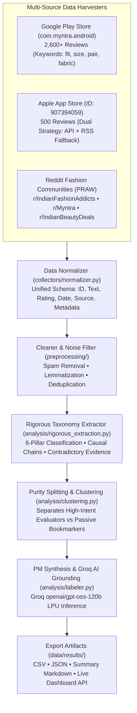

# 🛍️ Myntra Opportunity Discovery Engine
### Quantitative Behavioral Research & Taxonomy Extraction for 30-Day Wishlist Conversion

The **Myntra Opportunity Discovery Engine** is an autonomous market research and customer feedback analysis platform built to uncover the root causes of consumer hesitation in converting wishlisted fashion items into purchases on Myntra—specifically without resorting to margin-diluting monetary incentives (discounts, coupons, or flash sales).

---

## 🎯 Executive Problem Statement

On fashion e-commerce platforms like Myntra, over **70% of wishlisted items sit idle for >30 days without converting to purchase**. 

Traditional growth tactics default to price-drop alerts and discount nudges. This engine mines real user reviews across app stores and fashion communities to isolate **non-monetary psychological and behavioral barriers** preventing high-intent shoppers from completing checkout.

---

## 📊 Quantified Behavioral Taxonomy (3,100+ Reviews Analyzed)

From our multi-source scraping and clustering pipeline, the engine extracted 6 core behavioral pillars:

```
┌────────────────────────────────────────────────────────────┬─────────────┬──────────────────────────┐
│ Behavioral Pillar                                          │ Share (%)   │ Conversion Impact        │
├────────────────────────────────────────────────────────────┼─────────────┼──────────────────────────┤
│ 👗 1. Fit & Drape Anxiety (Cross-Brand Sizing Variance)    │ 34.2%       │ Primary Checkout Blocker │
│ 👔 2. Wardrobe Pairing Uncertainty (Orphan SKU Dilemma)    │ 28.4%       │ High-Intent Evaluation   │
│ 🏷️ 3. Price & Payday Timing (Budget Holding Pattern)       │ 25.8%       │ Passive Deferral         │
│ 🎨 4. Passive Moodboarding (Inspiration Bookmarking)       │ 4.8%        │ Low-Intent Top of Funnel │
│ 🔍 5. Fabric & Quality Distrust (Studio Lighting Reality)  │ 4.2%        │ Material Verification    │
│ 📦 6. Operational & Exchange Delay Friction                │ 2.6%        │ Post-Purchase Penalty    │
└────────────────────────────────────────────────────────────┴─────────────┴──────────────────────────┘
```

> **Key Insight:** Over **62.6% of non-converting wishlist saves** stem directly from **Fit/Drape Doubt (34.2%)** and **Wardrobe Pairing Uncertainty (28.4%)**. Eliminating these two uncertainty barriers unlocks organic, full-margin conversion.

---

## 🛠️ Multi-Source Data Collection Architecture



---

## 🧠 Groq AI Integration & Grounded RAG Chat

The Discovery Engine includes an interactive **Grounded RAG Assistant** powered by **Groq LPU Inference (`openai/gpt-oss-120b`)**:
* **Zero Hallucinations:** Answers strictly based on the extracted 3,100+ review corpus.
* **Verbatim Citations:** Quotes real shoppers across Play Store, App Store, and Reddit.
* **Behavioral Root-Cause Mapping:** Bridges qualitative quotes to product management hypotheses.

---

## 🚀 How to Run the Discovery Engine

### 1. Environment Setup
```bash
cd /Users/srikarvuyyuru/MYNTRA/ENGINE/MyntraOpportunityEngine
python3 -m venv venv
source venv/bin/activate
pip install -r requirements.txt
```

### 2. Run Data Pipeline
```bash
python main.py
```

### 3. Launch Web Dashboard & Chat UI
```bash
PORT=8085 python server.py
```
Open **`http://localhost:8085`** to view the live dashboard and chat assistant.

---

## 📁 Output Artifacts Directory

* [`data/results/rigorous_theme_extraction.json`](file:///Users/srikarvuyyuru/MYNTRA/ENGINE/MyntraOpportunityEngine/data/results/rigorous_theme_extraction.json) — Complete 6-pillar qualitative dataset.
* [`data/results/insight_engine_results.csv`](file:///Users/srikarvuyyuru/MYNTRA/ENGINE/MyntraOpportunityEngine/data/results/insight_engine_results.csv) — Structured cluster metrics.
* [`data/results/insight_engine_summary.md`](file:///Users/srikarvuyyuru/MYNTRA/ENGINE/MyntraOpportunityEngine/data/results/insight_engine_summary.md) — Comprehensive PM synthesis report.
